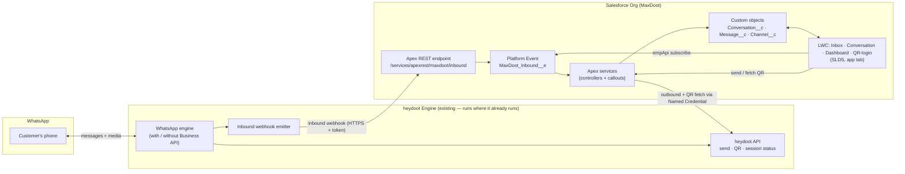
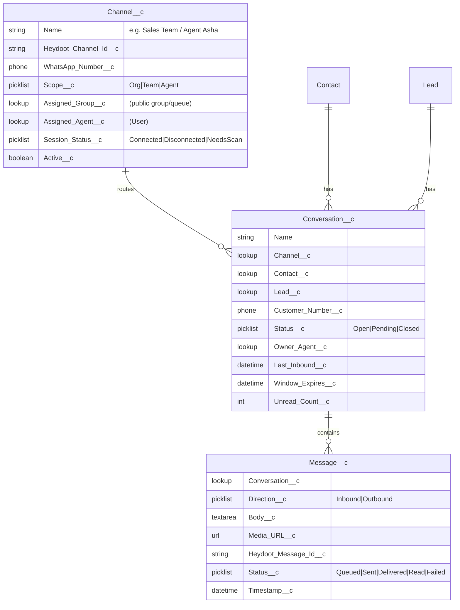

# MaxDoot — Architecture & Framework

> **MaxDoot** is a Salesforce-embedded edition of *heydoot*. It surfaces WhatsApp
> conversations inside the Salesforce UI **without** Salesforce Messaging for
> WhatsApp (Digital Engagement), avoiding its per-conversation / per-agent
> licensing. The WhatsApp engine is **heydoot itself** — MaxDoot drives it over
> heydoot's API for send/receive and renders heydoot's **QR login inside the
> Salesforce window**.

> **Decisions locked in (2026-06-03)**
> - **Engine:** reuse the existing **heydoot** engine via its API (send + receive).
>   No new WhatsApp stack is built. QR scanning is surfaced inside Salesforce.
> - **Distribution:** **single-org tool**, deployed per customer by us. No
>   AppExchange, no managed package, no namespace. → SFDX source / unmanaged deploy.
> - **Hosting:** heydoot keeps running **where it already runs**. MaxDoot adds no
>   new always-on service of its own (see §2 note).
> - **Number routing:** **per-team / per-agent, configurable**, and can fall back
>   to a single org-wide number. → a configurable Channel object (§5).

---

## 1. Why not Digital Engagement?

Salesforce's native WhatsApp is the **Digital Engagement** add-on, billed per
conversation and per messaging user. MaxDoot reproduces the agent experience
using only features bundled with most Salesforce editions, and points them at
heydoot:

| Capability        | Native (Digital Engagement) | MaxDoot                                    |
| ----------------- | --------------------------- | ------------------------------------------ |
| WhatsApp channel  | Licensed add-on             | **heydoot** (existing engine, via its API) |
| Agent inbox UI    | Service Console / Omni      | Custom **LWC** tab (SLDS, native look)     |
| Data storage      | MessagingSession objects    | Custom objects (`Conversation__c`, etc.)   |
| Real-time to agent| Omni-Channel                | **Platform Events + empApi**               |
| Billing           | Per conversation/user       | Only heydoot's existing WhatsApp costs     |

---

## 2. High-level framework



**Note on "hosting" (answering your question):** MaxDoot's *UI and logic are
embedded in Salesforce* — correct. But the **WhatsApp engine cannot live inside
Salesforce**: Apex can't hold a persistent WhatsApp session or scan a QR. That
engine is **heydoot**, and it already runs somewhere today. So there's **no new
gateway to host** — MaxDoot just needs heydoot's API URL + credentials
(stored in a Salesforce **Named Credential**) and a webhook pointing back at a
Salesforce Apex REST endpoint. The only "hosting" question left is whether
heydoot's current deployment can (a) reach Salesforce for webhooks and (b)
expose the QR + session-status endpoints — see §8.

---

## 3. Component breakdown

### 3.1 Salesforce org — MaxDoot (everything we build)
- **Lightning App + Tab** `MaxDoot`, styled with **SLDS** for a native look.
- **LWC components**
  - `maxdootInbox` — open conversations list (unread badges, last-message
    preview, window/SLA timer), filterable by Channel / team / agent.
  - `maxdootConversation` — to-and-fro thread, composer, media attach,
    template/quick-reply picker.
  - `maxdootDashboard` — KPIs: open, unassigned, avg response time, volume.
  - `maxdootChannelSetup` — **renders heydoot's QR code inside Salesforce** and
    shows live session status (connected / disconnected / needs re-scan).
- **Apex**
  - `MaxDootInboundResource` — `@RestResource` endpoint heydoot's webhook POSTs
    to; verifies a shared token, publishes `MaxDoot_Inbound__e`.
  - `MaxDootInboundTrigger` — on the Platform Event: upserts
    `Conversation__c`/`Message__c`, resolves Contact/Lead by phone, applies
    routing to a Channel/owner.
  - `MaxDootSendController` — `@AuraEnabled`; outbound callout to heydoot API
    via **Named Credential**.
  - `MaxDootChannelController` — `@AuraEnabled`; fetches QR + session status
    from heydoot for `maxdootChannelSetup`.
  - `MaxDootRouting` — phone→Contact/Lead match + Channel/agent assignment.
- **Custom objects** (§5) and **Platform Event** `MaxDoot_Inbound__e`.
- **Permission set** `MaxDoot_Agent` (+ `MaxDoot_Admin` for channel setup).
- **Named Credential** `heydoot` — base URL + auth to heydoot's API; no secrets
  in Apex.

### 3.2 heydoot Engine (existing — not built here)
Treated as a black box exposing an API. MaxDoot depends on it for:
- **Send** — text / media / (template, if supported).
- **Inbound** — webhook POST to MaxDoot's Apex REST endpoint per message + delivery/read status.
- **QR + session** — endpoint(s) returning the login QR (image or string) and
  current session status, addressable **per channel/number** (for multi-number).

> If heydoot can't POST webhooks directly to Salesforce (auth/format), a **thin
> stateless connector** can be added later to translate + authenticate. We
> design the contract so this is optional — see §8.

---

## 4. heydoot connection model (confirmed)

Because heydoot already abstracts *with/without Business API* internally,
MaxDoot doesn't implement WhatsApp providers at all. It needs a stable
**API contract** with heydoot. Confirmed facts:

- **Send:** REST, **Bearer-token** auth + base URL. ✅
- **Multi-number:** each number/session is addressed by its **own bearer token**
  (not a URL path id). ✅ → the token lives **per `Channel__c` record**.
- **Inbound:** heydoot can **webhook a Salesforce endpoint directly** (no relay
  needed). ✅
- **QR/session:** likely surfaced as an **embeddable page (iframe)**; a JSON QR
  API is a fallback. ⏳ (confirming)

```
Outbound (Apex → heydoot):   POST {base}/v1/messages        Authorization: Bearer <channel token>
Inbound  (heydoot → Apex):   POST /services/apexrest/maxdoot/inbound   header X-MaxDoot-Token
QR (preferred):              iframe of Channel__c.Iframe_QR_URL__c   (CSP Trusted Site)
QR/status (fallback API):    GET {base}/v1/qr , GET {base}/v1/status   Bearer <channel token>
```

**The bearer token is the channel identity.** `Channel__c.Bearer_Token__c` ties a
Salesforce routing unit (org/team/agent) to one heydoot number. Inbound messages
are matched back to a channel by the destination WhatsApp number (or an optional
`Heydoot_Channel_Id__c` if heydoot sends one).

> Paths are configurable in `MaxDoot_Config__mdt`; pin them to heydoot's real
> endpoints when confirmed.

---

## 5. Salesforce data model



- **`Channel__c` is the configurable routing unit** you asked for: `Scope__c`
  switches between one org-wide number, per-team, or per-agent. Inbound is
  routed to the owning group/agent based on the channel the message arrived on.
- `Heydoot_Message_Id__c` is the **idempotency key** (webhooks may retry).
- `Window_Expires__c` drives the 24h-window UI if/when the Business-API path is used.

---

## 6. Key flows

**Channel onboarding (QR inside Salesforce)**
1. Admin opens `maxdootChannelSetup` for a `Channel__c`.
2. LWC → `MaxDootChannelController` → heydoot `GET /qr` → renders QR in Salesforce.
3. Admin scans with the WhatsApp phone; LWC polls `GET /status` until `Connected`.
4. `Channel__c.Session_Status__c` updates; channel is now live.

**Inbound (customer → agent)**
1. Customer messages the number → heydoot engine receives it.
2. heydoot webhook → `POST /services/apexrest/maxdoot/inbound` (shared-token auth).
3. `MaxDootInboundResource` publishes `MaxDoot_Inbound__e`.
4. PE trigger upserts `Conversation__c`/`Message__c`, matches Contact/Lead,
   routes by `Channel__c`.
5. LWC `empApi` subscription updates the thread live.

**Outbound (agent → customer)**
1. Agent sends in `maxdootConversation`.
2. `MaxDootSendController` → callout (Named Credential) → heydoot `POST .../messages`.
3. heydoot returns its message id → Apex writes `Message__c` (Queued).
4. Delivery/read receipts arrive via the same inbound webhook → status updates.

---

## 7. Tech stack

| Layer            | Choice                                            | Why                                         |
| ---------------- | ------------------------------------------------- | ------------------------------------------- |
| Salesforce UI    | **LWC + SLDS**, SFDX source format                | Native look; deployable per-org             |
| SF server        | **Apex** (REST resource, PE trigger, controllers) | Only in-org option                          |
| Real-time to UI  | **Platform Events + `lightning/empApi`**          | No Omni/Digital Engagement needed           |
| SF → heydoot     | **Named Credential** callouts                     | Secretless; QR fetch + send                 |
| heydoot → SF     | **Apex `@RestResource`** webhook + shared token   | No middleware needed (if heydoot can reach it) |
| Distribution     | **SFDX unmanaged source deploy** (per customer)   | Single-org; no namespace / no security review |

No new always-on service is introduced by MaxDoot; heydoot is the only
long-running component and it already exists.

---

## 8. Advice, risks & what I still need from heydoot

**heydoot API facts (answered):**
1. **Send API** — ✅ REST, Bearer-token auth + URL.
2. **Inbound delivery** — ✅ heydoot can webhook a Salesforce endpoint directly
   (no relay connector needed). Endpoint exposure options below.
3. **QR + session** — ⏳ likely an **embeddable page (iframe)**; JSON QR API is a
   fallback. MaxDoot supports both (`Iframe_QR_URL__c` first, API QR otherwise).
4. **Multi-number** — ✅ addressed by a **per-number bearer token**, stored on
   `Channel__c.Bearer_Token__c`.

**Exposing the inbound webhook (important):** Apex REST normally needs an
authenticated session. Two ways to let heydoot POST in:
- **Public Force.com Site** — grant the Site guest user access to
  `MaxDootInboundResource`; heydoot POSTs to the site domain unauthenticated and
  the `X-MaxDoot-Token` header is the security boundary. *(Simplest for heydoot.)*
- **OAuth** — a Connected App; heydoot obtains a Salesforce token (JWT) and calls
  the `*.my.salesforce.com` REST URL with both tokens.

**Advice**
- **Keep Salesforce as the system of record** for agents; heydoot stays the
  channel engine + operational log.
- **Idempotency on `Heydoot_Message_Id__c`** — webhooks retry.
- **Secretless Apex** — heydoot credentials live in a Named Credential; the
  inbound webhook is guarded by a rotating shared token (and IP allow-list if
  heydoot has a static egress IP).
- **QR session lifecycle** — surface disconnect/expiry clearly in
  `maxdootChannelSetup`; sessions drop and need re-scan.

**Risks**
- ⚠️ If heydoot uses the **unofficial WhatsApp-Web** path, number-ban risk
  remains; isolate channels so one ban doesn't block others.
- ⚠️ **Salesforce governor limits** — Platform Event caps, Apex callout limits
  (100/txn, 120s), and **data storage** at volume (plan archiving of old
  `Message__c`).
- ⚠️ **PII/retention** — WhatsApp content is personal data; define retention and
  respect field-level security; consider Shield if the customer requires it.

---

## 9. Suggested repository layout

```
MaxDoot/
├── docs/
│   └── ARCHITECTURE.md          ← this file
└── salesforce/                  ← SFDX project (the whole product)
    ├── sfdx-project.json
    └── force-app/main/default/
        ├── lwc/                 (maxdootInbox, maxdootConversation,
        │                         maxdootDashboard, maxdootChannelSetup)
        ├── classes/             (MaxDootInboundResource, MaxDootInboundTrigger,
        │                         MaxDootSendController, MaxDootChannelController,
        │                         MaxDootRouting + tests)
        ├── objects/             (Channel__c, Conversation__c, Message__c)
        ├── platformEvents/      (MaxDoot_Inbound__e)
        ├── namedCredentials/    (heydoot)
        ├── permissionsets/      (MaxDoot_Agent, MaxDoot_Admin)
        └── applications/        (MaxDoot app + tab)

# Optional, only if heydoot can't webhook Salesforce directly:
# └── connector/   (thin stateless relay: heydoot webhook → Salesforce PE)
```

No `gateway/` directory — heydoot is the engine and already exists.

---

## 10. Suggested phasing

1. **Phase 0 — Skeleton & contract.** SFDX project, custom objects, Platform
   Event, Named Credential, and the **heydoot API contract** pinned to its real
   endpoints.
2. **Phase 1 — QR onboarding.** `maxdootChannelSetup` renders heydoot's QR in
   Salesforce + live session status. Proves the heydoot↔Salesforce link.
3. **Phase 2 — Inbound.** Webhook → Apex REST → Platform Event → `Message__c` →
   live LWC thread. Contact/Lead matching + Channel routing.
4. **Phase 3 — Outbound + receipts.** Send from LWC; delivery/read status.
5. **Phase 4 — Dashboard + routing config.** KPIs, per-team/per-agent/org-wide
   `Channel__c` setup, window/SLA timers.
6. **Phase 5 — Hardening & per-customer deploy.** Permission sets, token
   rotation, archiving, repeatable SFDX deploy script per customer org.
