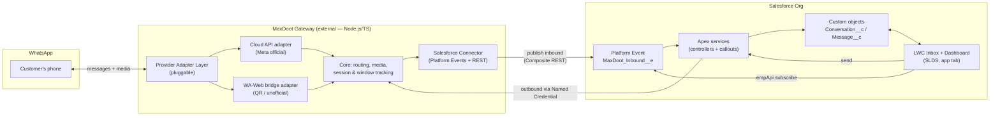
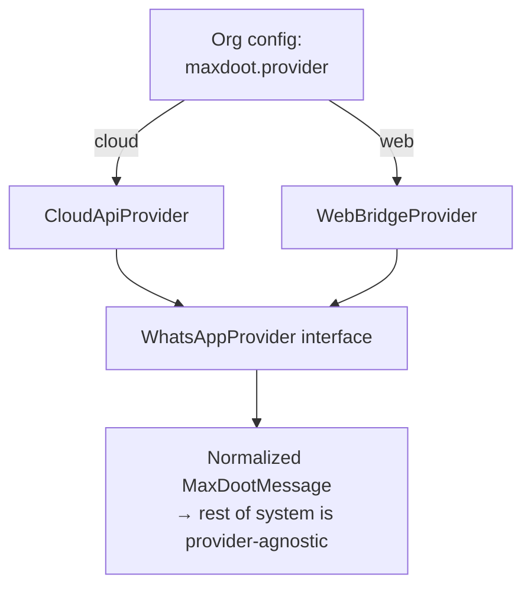
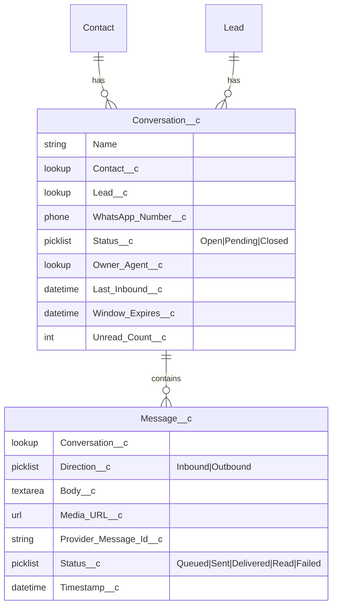

# MaxDoot — Architecture & Framework

> **MaxDoot** is a Salesforce-embedded edition of *heydoot*. It brings WhatsApp
> conversations directly into the Salesforce UI **without** using Salesforce
> Messaging for WhatsApp (Digital Engagement), thereby avoiding its
> per-conversation / per-agent licensing. It supports both the **official
> WhatsApp Business Cloud API** and an **unofficial WhatsApp-Web bridge** for
> orgs that don't (yet) have the official API.

---

## 1. Why not Digital Engagement?

Salesforce's native WhatsApp channel is part of the **Digital Engagement**
add-on, billed per conversation and per messaging user. MaxDoot reproduces the
agent experience using only features bundled with most Salesforce editions:

| Capability            | Native (Digital Engagement) | MaxDoot                                  |
| --------------------- | --------------------------- | ---------------------------------------- |
| WhatsApp channel      | Licensed add-on             | External **MaxDoot Gateway**             |
| Agent inbox UI        | Service Console / Omni      | Custom **LWC** tab (SLDS, native look)   |
| Data storage          | MessagingSession objects    | Custom objects (`Conversation__c`, etc.) |
| Real-time to agent    | Omni-Channel                | **Platform Events + empApi**             |
| Billing               | Per conversation/user       | Only Meta/BSP message fees               |

The trade-off: MaxDoot is responsible for the channel plumbing, compliance
windows, and (in unofficial mode) the ToS risk that Salesforce would otherwise
shoulder. See §8.

---

## 2. High-level framework



**Two halves, one contract.** Everything WhatsApp-specific and long-running
lives in the **Gateway**. Everything agent-facing lives in **Salesforce**. They
communicate over a small, versioned HTTP + event contract (§6) so either side
can evolve independently.

---

## 3. Component breakdown

### 3.1 Salesforce org (the "native" experience)
- **Lightning App + Tab** — `MaxDoot` app with a single home tab; styled with
  **SLDS** so it's indistinguishable from standard Salesforce.
- **LWC components**
  - `maxdootInbox` — left rail: list of open conversations (unread badges,
    last-message preview, SLA timer for the 24h window).
  - `maxdootConversation` — message thread (to-and-fro bubbles), composer,
    template picker, media attach.
  - `maxdootDashboard` — KPIs: open conversations, unassigned, response time,
    volume by day.
- **Apex**
  - `MaxDootInboundHandler` — subscribes nothing; instead a trigger on the
    Platform Event upserts `Conversation__c` / `Message__c` and links to
    Contact/Lead by phone.
  - `MaxDootSendController` — `@AuraEnabled` send method → callout to Gateway
    via **Named Credential** (stores the Gateway URL + auth, no secrets in code).
  - `MaxDootMatchService` — phone-number → Contact/Lead/Account resolution.
- **Custom objects** (§5).
- **Platform Event** `MaxDoot_Inbound__e` — high-volume event the Gateway
  publishes into; LWC subscribes via **`lightning/empApi`** for live updates.
- **Permission set** `MaxDoot_Agent` — gates object + Apex + tab access.

### 3.2 MaxDoot Gateway (external service)
Runs outside Salesforce because it needs (a) a public webhook endpoint, (b) a
persistent process for the WA-Web socket, and (c) media handling — none of
which Apex can do.

- **Provider Adapter Layer** — a single `WhatsAppProvider` interface with two
  implementations:
  - `CloudApiProvider` — Meta Graph API; receives webhooks, sends messages &
    templates, handles media via Meta's media endpoints.
  - `WebBridgeProvider` — QR-login session (e.g. Baileys/whatsapp-web.js);
    emits the same normalized events. **Unofficial — see §8.**
- **Core** — normalizes inbound/outbound to a canonical `MaxDootMessage`,
  tracks the **24-hour service window** per contact, manages media
  upload/download, dedupes, retries.
- **Salesforce Connector** — publishes inbound via **Composite REST** to the
  Platform Event; exposes `/v1/messages` for outbound from Apex; uses a
  **Connected App + JWT bearer flow** (server-to-server, no interactive login).
- **Datastore** — Postgres for message log/idempotency + Redis for session
  state and rate-limiting. (Salesforce remains the system of record for the
  agent; the Gateway keeps an operational log.)

---

## 4. Provider strategy (with / without Business API)



The interface keeps a hard line so the rest of MaxDoot never knows which
provider is active:

```ts
interface WhatsAppProvider {
  sendText(to: string, body: string): Promise<ProviderMessageId>;
  sendTemplate(to: string, tpl: TemplateRef, vars: string[]): Promise<ProviderMessageId>;
  sendMedia(to: string, media: MediaRef, caption?: string): Promise<ProviderMessageId>;
  onInbound(handler: (m: NormalizedInbound) => void): void;   // webhook OR socket
  onStatus(handler: (s: DeliveryStatus) => void): void;       // sent/delivered/read
}
```

This means: ship with the **Web bridge** for instant value (just scan a QR),
and let customers **upgrade to the Cloud API** later by flipping config — no
change to the Salesforce side.

---

## 5. Salesforce data model



- `Provider_Message_Id__c` is the **idempotency key** — protects against
  duplicate Platform Event delivery.
- `Window_Expires__c` drives the UI's "session window closing" warning and
  forces template-only sends after 24h (Cloud API rule).

---

## 6. Key flows

**Inbound (customer → agent)**
1. WhatsApp delivers to Gateway (webhook for Cloud API; socket event for Web).
2. Adapter normalizes → Core resolves/creates session, stores media in object store.
3. Connector publishes `MaxDoot_Inbound__e` via Composite REST (JWT auth).
4. Platform Event trigger upserts `Conversation__c`/`Message__c`, matches Contact.
5. LWC `empApi` subscription receives the event → thread updates live.

**Outbound (agent → customer)**
1. Agent types/sends in `maxdootConversation`.
2. `MaxDootSendController.send()` → callout via Named Credential → Gateway `/v1/messages`.
3. Active adapter sends; returns `ProviderMessageId`; Apex writes `Message__c` (Queued).
4. Delivery/read receipts come back as inbound status events → `Message__c.Status__c` updates.

**Template / outside-window send**
- If `Window_Expires__c` has passed, composer disables free-text and shows the
  approved **template picker** (Cloud API). Web-bridge mode has no template
  concept, so it allows free text but surfaces the ToS warning.

---

## 7. Recommended tech stack

| Layer            | Choice                                       | Why                                              |
| ---------------- | -------------------------------------------- | ------------------------------------------------ |
| Salesforce UI    | **LWC + SLDS**, SFDX source format           | Native look, modern, packageable                 |
| SF server        | **Apex** (controllers + Platform Event trigger) | Only option in-org                            |
| Real-time to UI  | **Platform Events + `lightning/empApi`**     | No Omni/Digital Engagement needed                |
| Gateway          | **Node.js + TypeScript** (Fastify)           | WA libs are JS-native; async I/O                 |
| Cloud API        | Meta Graph API                               | Official path                                    |
| Web bridge       | Baileys (or whatsapp-web.js)                 | No API onboarding; QR login                      |
| Gateway store    | **Postgres + Redis**                         | Log/idempotency + session/rate state             |
| SF ↔ Gateway     | Named Credential (out), Connected App + JWT (in) | Secretless callouts, server-to-server auth   |
| Hosting          | Heroku / AWS ECS / Fly.io                    | Persistent process + public endpoint             |
| Packaging        | **2GP managed package** (later)              | Distribution to other orgs / AppExchange path    |

---

## 8. Advice, risks & decisions to make

**Strong recommendations**
- **Build provider-agnostic from day one.** The adapter interface (§4) is the
  single most important design decision — it lets you ship the Web bridge fast
  and migrate customers to the Cloud API with zero Salesforce changes.
- **Salesforce is the system of record** for agents; the Gateway keeps only an
  operational log. Don't split the source of truth.
- **Idempotency everywhere** — Platform Events are *at-least-once*; key on
  `Provider_Message_Id__c`.
- **Secretless on the SF side** — Named Credentials + JWT. No tokens in Apex.

**Risks to flag now**
- ⚠️ **Unofficial Web bridge violates WhatsApp's ToS** and risks number bans.
  Position it as a trial/SMB on-ramp; make the Cloud API the recommended
  production path. Isolate the bridge so a ban can't take down the org.
- ⚠️ **24-hour window + template approval** (Cloud API) — must be modeled in UI
  or agents will hit silent send failures.
- ⚠️ **Salesforce governor limits** — Platform Event publish caps, Apex callout
  limits (max 100/transaction, 120s), and **data storage** for high message
  volume. Consider archiving old `Message__c` to the Gateway/BigObjects.
- ⚠️ **PII & compliance** — WhatsApp content is personal data; encrypt at rest
  in the Gateway, define retention, and respect Shield/field-level security in SF.

**Decisions I'd like your call on**
1. **Launch provider** — Web bridge first (fast, risky) vs Cloud API first
   (slower onboarding, production-grade)? Recommendation: build both, **default
   to Web bridge for the demo**, Cloud API for GA.
2. **Distribution** — single-org internal tool, or **2GP managed package** for
   resale on AppExchange? This affects naming, namespaces, and security review.
3. **Gateway host** — Heroku (fastest), AWS, or your existing infra?
4. **Multi-number / routing** — one WhatsApp number for the whole org, or per
   team/agent? Affects the data model and session ownership.

---

## 9. Suggested repository layout

```
MaxDoot/
├── docs/
│   └── ARCHITECTURE.md          ← this file
├── salesforce/                  ← SFDX project
│   ├── sfdx-project.json
│   └── force-app/main/default/
│       ├── lwc/                 (maxdootInbox, maxdootConversation, maxdootDashboard)
│       ├── classes/             (Apex controllers, services, PE trigger handler)
│       ├── objects/             (Conversation__c, Message__c)
│       ├── platformEvents/      (MaxDoot_Inbound__e)
│       ├── permissionsets/      (MaxDoot_Agent)
│       └── applications/        (MaxDoot app + tab)
└── gateway/                     ← Node.js/TS service
    ├── src/
    │   ├── providers/           (cloud-api/, web-bridge/, provider.interface.ts)
    │   ├── core/                (router, window-tracker, media, idempotency)
    │   ├── salesforce/          (connector: PE publish + JWT auth)
    │   └── api/                 (Fastify routes: /v1/messages, /webhook)
    ├── package.json
    └── Dockerfile
```

---

## 10. Suggested phasing

1. **Phase 0 — Skeleton & contract.** Repo layout, define the SF↔Gateway
   contract (event schema + `/v1/messages`), stub provider interface.
2. **Phase 1 — Inbound MVP.** Web-bridge inbound → Platform Event → `Message__c`
   → live in a basic LWC thread. Proves the hardest plumbing first.
3. **Phase 2 — Outbound + matching.** Send from LWC, Contact/Lead resolution,
   delivery receipts.
4. **Phase 3 — Dashboard + window/SLA.** KPIs, 24h timer, unread counts.
5. **Phase 4 — Cloud API provider + templates.** Flip-the-switch upgrade path.
6. **Phase 5 — Packaging & hardening.** 2GP package, permission sets, security
   review prep, archiving strategy.
